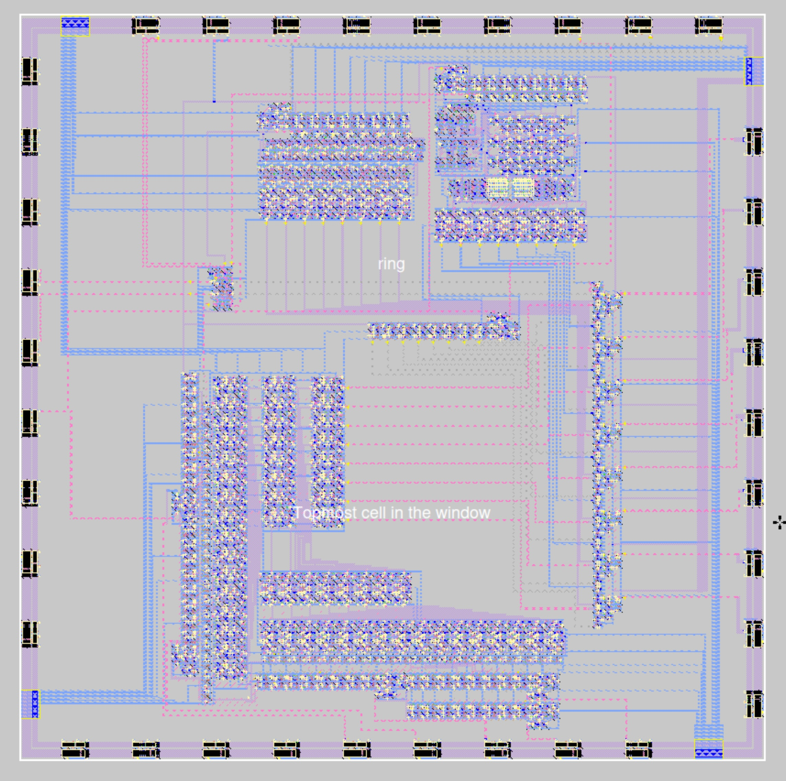

# Yale ECE4250 VLSI Chip

Designed in Magic VLSI by hand.

The final project generated random numbers using an 8-bit LFSR with four polynomially approximated probability distributions (uniform, gaussian, rayleigh, and exponential) with single-cycle fully combinational logic.

Final project die shot (designed for TSMC 180):

